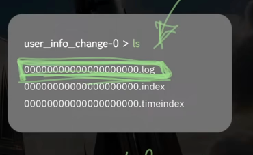
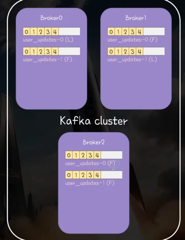
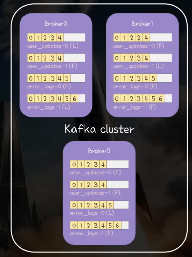
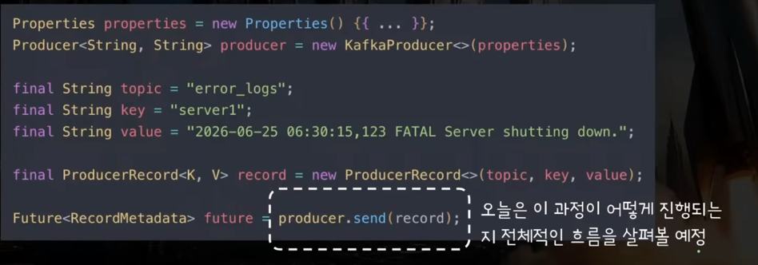
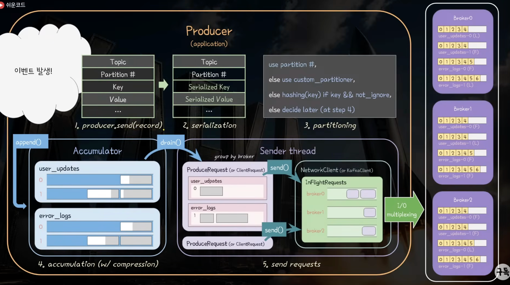
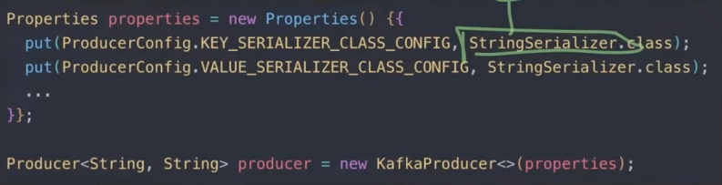
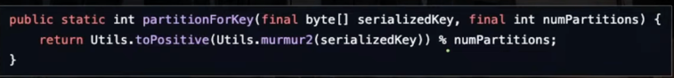

## 주요 문장
- 파티션 안에서는 순서가 보장되지만 파티션간에는 순서가 보장되지 않는다.
- Replication은 파티션 단위로 이어짐
- Offset 추적은 Consumer Group 단위로 관리됨

## 주요 개념

- Kafka : 분산 이벤트 스트리밍 플랫폼
  - open-source
  - distributed : 여러 대 컴퓨터를 네트워크로 연결해 하나의 거대한 시스템처럼 동작
  - event : 소프트웨어 시스템에서 발생한 사실을 나타내는 '불변 데이터'
  - streaming : 이벤트가 데이터 소스에서 목적지까지 '끊임없이 실시간으로' 흐르는 상태 <-> Batch
  - platform : 데이터 파이프라인의 뼈대가 되는 중앙 허브

- Kafka Cluster : 카프카가 동작하는 프로세스(서버) 집합
  - 확장성 : 브로커 추가를 통한 수평확장 용이
  - 안전성 : 분산/복제를 통한 장애 허용성 확보
  
- Broker : Kafka Cluster를 구성하는 프로세스 각각
  - 운영환경에서는 서버와 프로세스가 1:1
  - 한 서버에 여러 프로세스를 띄워서 클러스터를 구성하는 것도 가능

## Topic & Partition & Offset

- Topic : 메시지가 분류되어 저장되는 주제/카테고리
  - ex) user_info_change : 사용자 정보 변경
  - 하나의 카프카에 여러개의 토픽을 만들 수 있음

- Partition : 병렬 처리를 위해 Topic은 여러 Partition으로 나눠짐
  - 메시지는 파티션 중 한 곳에 / 불변으로 / append 됨 
  - FIFO이지만 소비되는 즉시 삭제되진 않는 log 성격(retention 기간 동안 존재)
    - [중요] Topic 단위 FIFO가 아니라 Partition 단위로 FIFO가 보장됨
  - 하나의 메시지는 반드시 하나의 파티션에만 저장(복제 record는 제외)
  - 분산의 단위 : 파티션 단위로 분산되어 저장

- Offset : 파티션 안에 저장된 메시지들의 순서
  - 0부터 순차적으로 증가함(64bit)

- Producer : 애플리케이션에서 발생한 이벤트를 topic에 저장
  - partitioner : 이벤트가 어떤 partition에 저장되어야 하는지를 결정

- Consumer : topic에 저장된 이벤트를 consume하여 목적에 맞게 처리
  - offset을 통해 어디까지 consume 했는지 추적 ex) 내가 A파티션에서 3번까지 읽었으니까 다음엔 4번 읽어야지

- Consumer Group : 동일한 목적으로 묶은 Consumer 그룹
  - 같은 group에 속한 consumer들은 partition들을 나눠 맡아 메시지 처리
  - offset 어디까지 읽었는지 관리는 Consumer Group 단위로 이뤄짐
    - 특정 consumer가 죽어도 같은 그룹의 다른 consumer가 이어 처리
  - partition 수보다 consumer가 더 많으면 노는 consumer 발생 (파티션이 3개인데 그룹 내 consumer가 4이면 1개가 아무 일 안함)
  - 서로 다른 Consumer group은 같은 topic도 독립적으로 consume
    - 어떤 이벤트 A에 대해서 피드 처리를 맡은 CG A, 알림 처리를 맡은 CG B가 있으면 독립적으로 처리
  - 모든 Consuemr는 Group 지정이 필수적으로 필요함

## Event & Message & Record
- 같은 개념인데 강조하는 관점만 다름
- Event(비즈니스) vs Message(전달) vs Record(카프카 내무 관점)

## Log & Segment

- Log : 하나의 파티션에 순서대로 append되는 immutable한 메시지 흐름
- Segment : Log를 실제로 저장하기 위해 여러개 파일로 나눈 단위
- Segment 파일 구성 : .log, .index, .timeindex 세개 파일이 하나의 segment
  - .log : 실제 메시지, 기록대상인 메시지들 중 첫 메시지의 offset응로 네이밍됨 ex) 0 offset 부터 기록된 log 파일 -> 0000000.log
  - .index, .timeindex : 실제 메시지를 인덱싱하기 위한 파일
  
- Segment가 필요한 이유
  - log를 하나로 관리하면 파일 크기가 너무 커져서 관리 힘듦 -> 일정 크기나 시간 단위로 새로운 segment 생성
  - active segment(현재 쓰고 있는 segment)만 append 가능 (나머지 segment들은 immutable)
  - log는 segment 단위로 삭제되고 특정 시간이나 사이즈 이상일 때 가장 오래된 것부터 삭제됨

## Replication & Leader & Follower & ISR

- Replication : 각 partition 데이터를 여러 브로커에 복제 -> 가용성 확보
  - Replication은 파티션 단위로 이루어짐
  
- Leader : partition에 produce/consume 요청을 처리하는 브로커 (한 partition 당 하나만 존재)
- Follower : Leader로부터 partition을 복제해 저장하는 브로커

- Replica : Leader + Follower
- ISR(In-Sync-Replica) : 복제가 잘 되고 있어 Leader와 동기화 상태인 replica들
  - 리더 다운 시 새로운 Leader 선출 후보
- Replication factor : topic을 생성할 때 원본 포함 복제본을 몇개 둘 것인지 설정
  - 보통 3을 추천하여 broker 수보다 클 수 없음

ex)
- Topic : user_updates
- partition 개수 : 2
- replication -factor : 3

-> 추가
- Topic : error_logs
- partition 개수 : 2
- replication -factor : 3

## Kraft & Zookeeper

- Zookeeper : Kafka라는 분산시스템을 안정적이고 일관성있게 유지하는데 필요한 메타데이터 관리 코디네이터
  - Kafka 구축할 때마다 별도로 Zookeeper도 설정 및 띄워주어야 했음
  -> 운영 복잡성, 스케일링 등등 여러 이슈로 은퇴

- Kraft : Zookeeper의 역할을 Kafka cluster 내부에서 일부 노드가 수행
  - 더 이상 Zookeeper cluster를 따로 구축, 관리할 필요가 없어짐

---

# 3부 : Producer와 Record

- 자바 기준
- Producer가 어떤 과정을 통해 Event를 카프카에 적재하는지

- Record 주요 필드 - 어디로(Topic + Partition + Key) + 무엇을(Value)
  - Topic
  - Partition(op) : 이벤트가 저장될 파티션 번호 -> 직접 지정
  - Key(op) : key가 있으면 hashing 하여 어느 파티션에 저장될지 결정
    - 같은 key는 같은 파티션에 저장되므로 순서 보장이 필요한 경우 key 설계를 잘하는 것이 중요
    - key를 지정하지 않을 Sticky partitioning이 디폴트로 동작
  - Value : 저장하려는 이벤트 내용들

## 전체 그림

### step1. producer.send(record) 
- 레코드 생성 : 같은 키는 같은 파티션 전달을 보장한다

### step2. (key, value) Serialize(직렬화)
- key, value를 byte[]로 직렬화 : 카프카는 바이트 배열로만 저장하고 전송
- string, integer 처럼 기본 타입들은 카프카가 기본적으로 제공

- 커스터마이징 한 value들 : User, Order
  - 범용 라이브러리(JSON, Thrift) 사용 [추천]
  - Serializer<T> 인터페이스를 구현해서 custom serializer로 사용
- Consumer에서는 바이트 배열을 역직렬화함

### step3. Partitioning(레코드의 파티션 목적지 결정)
- 1순위 : partition 직접 지정
- 2순위 : 유저가 지정한 custom partitioner
- 3순위 : key가 있고 무시하라는 설정을 하지 않았다면 hashing(key)
  - 같은 key는 hashing 값이 동일하므로 같은 partition에 저장됨
  - 순서를 보장하고 싶다면 key 설계가 중요함(같은 파티션 내에서는 순서대로 consume 됨)
  - 
- 4순위 : 디폴트는 Sticky partitioning 

### step4. Accumulation(논리적 단위 그루핑 - 파티션 배치)
- Topic - partition 별로 record를 내부(Deque)에 저장
- `배치` 단위로 저장(bath from BufferPool) -> 고트래픽 상황에서 묶어 보내는 것이 더 효율적이기 떄문에
  - 기존 배치에 여유 있으면 바로 저장
  - 기존 배치가 없거나 여유 공간 부족하면 새로 배치 만들고 저장
- 압축 설정 : 버퍼에 append 될 때 압축 실행됨

### Step5. Client(물리적 단위 그루핑)
- Sender Thread : 백그라운드에서 비동기로 동작
- drain : 전송 가능한 배치들을 꺼내와 broker 단위로 그루핑하여 ProducerRequest 만듦
- KafkaClient(interface) <- NetworkClient(impl)
  - 네트워크 클라이언트에 send(ProducerRequest request) 존재
  - InFlightRequests라는 구현체 -> broker 별로 deque(ProducerRequests를 또 묶음)
- I/O multiplexing으로 보냄
- 전송 결과를 전달하는 역할도 Sender Thread가
