# 핵심 한장
- Buffer Memory 할당 알기
- ACK 설정과 min.insync.replica 설정 
- Send 관련 5가지 timeout
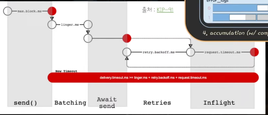

# 1. Producer 객체
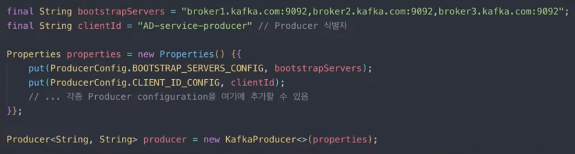

- ProducerConfig의 주요 내용들은 공식문서 참고

### 브로커 주소목록 : bootstrap.servers(BOOTSTRAP_SERVERS_CONFIG)
  - 브로커 host:port 리스트 for 카프카 클러스터 연결
  - 모든 브로커 지정 필요 X, 하나만 연결되면 전체 브로커 목록을 받아옴
  - but, 두개 이상 지정 권장 -> 하나 다운되었을 때 브로커 정보 추출이 불가해질 수 있음

### Producer 이름 짓기 : client.id(CLIENT_ID_CONFIG)
- producer에 논리적 이름 부여 "AD-service-producer"
- 브로커 쪽에서 로깅 & 디버깅 & 메트릭 해석에 좋음
- client ID != group ID

---

# 2. Serialization

### 직렬화 도구 : key.serializer(KEY_SERIALIZER_CLASS_CONFIG), value.serializer(VALUE_SERIALIZER_CLASS_CONFIG)
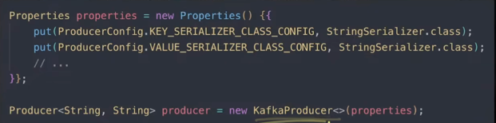
- key, value를 바이트 배열로 직렬화하기 위한 클래스 지정 필요
- 자체 구현한 Serializer, 라이브러리에서 제공하는 Serializer도 가능
- key를 쓰지 않을 경우에는?
  - StringSerializer를 등록하고 key 값에 null
  - 명시적으로 key를 안쓴다고 표시하기 위해 VoidSerializer 등록

---

# 3. Partitioning

### 커스텀 파티셔너 지정 : partitioner.class(PARTITIONER_CLASS_CONFIG, null)
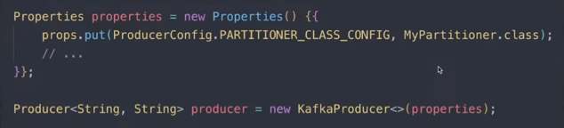
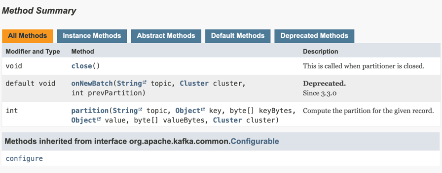
- org.apache.kafka.clients.producer.Partitioner 인터페이스를 구현한 클래스면 뭐든지 지정 가능
- 목적지 결정 과정 : 직접 지정 -> 커스텀 파티셔너 -> 키 해싱(ignore=false) -> Default Sticky Partitioning

### 키 무시 : partitioner.ignore.keys(PARTITIONER_IGNORE_KEYS_CONFIG, false)
- ture가 되면 partition을 결정하는데 key가 사용되지 않음

---

# 4. Accumulation : partition 별로 Batch로 묶기

### 배치 사이즈 : batch.size(BATCH_SIZE, 16KB)
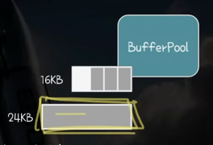
- 레코드 사이즈가 batch size보다 클 경우 레코드 크기만큼의 특별한 배치를 할당
- 20KB 레코드 -> 20KB 배치 할당 / 4KB -> 기존 배치에 공간 남으면 추가, 초과하면 16KB 배치 할당
- 배치는 BufferPool에서 batch.size만큼 할당받아 만들어짐 -> 점차 늘리는게 아니라 처음부터 size 만큼 메모리 할당(리스트가 아니라 배열)
  - 작은 배치 사이즈 -> 병렬 처리량이 적음(한번에 묶는 단위가 적음)
  - 큰 배치 사이즈 -> 메모리 낭비 가능성이 높아짐
- batch size를 0으로 두면 batch로 동작하는 것을 비활성화 시킴

### 배치가 drain까지 대기하는 최대 시간 : linger.ms(LINGER_MS_CONFIG, 5ms)
- 다 안 찬 배치들은 전송되지 않나? -> 다 차지 않아도 `linger.ms` 만큼 기다렸다가 처리됨
- 무조건 linger.ms만큼 기다리나요? -> 배치가 다 차면 처리됨

### 버퍼 메모리 : buffer.memory(BUFFER_MEMORY, 32MB)
- 배치들을 위해 할당할 수 있는 메모리 상한선
- BufferPool 내부에 재사용 목적으로 batch들을 모아두는 deque 존재(batch size에 해당하는 batch들만)
- batch에 남은 공간 안에 레코드 사이즈가 들어가면 추가, 
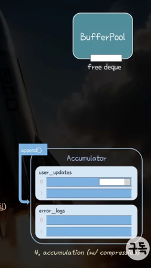
  - 없으면 BufferPool에 allocate(size, maxTimetoBlockMs) 요청
    - 요청한 size가 batch.size와 동일하고 deque에 미리 할당한 batch 메모리 공간이 있으면 그걸 할당
    - 아니면 최대 메모리(buffer.memory) 대비 여유 공간이 있으면 만들어서 할당
    **- 아니면 최대 max.block.ms동안 기다리며 여유공간이 생기길 대기 -> producer.send()가 블락됨**
    - max.block.ms를 기다려도 배치 공간이 나지 않는다면 -> 예외 발생

### 버퍼 메모리 여유가 없을때 기다리는 최대 시간 : max.block.ms(MAX_BLOCK_MS_CONFIG, 60sec)
- 해당 시간이 지나는 동안 BufferPool 여유 공간이 안나면 exception
- 꼭 버퍼풀 공간 할당이 아니라 최대 블락킹되는 시간 정도로 해석
  - partitionFor(), initTransactions(), sendOffsetsToTransaction(), commitTransaction(), abortTransaction() 등

### 압축 타입 : compression.type(COMPRESSION_TYPE_CONFIG, none)
- 레코드 압축해서 카프카 클러스터에 저장하고 싶을 때 사용
- 사용 가능한 값 : none, **ztsd,** lz4, snappy, gzip
- 압축은 Batch 단위로 이어짐 -> Batch.size, linger.ms를 늘릴 수록 압축 효율이 좋아짐

---

# 5. Send Requests

### ProduceRequest 최대 크기 : max.request.size(MAX_REQUEST_SIZE_CONFIG, 1MB)

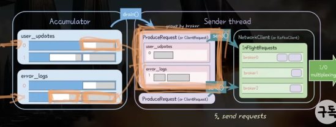
- ProduceRequest의 크기 상한 : 각 브로커별로 전송할 batch 총합 크기의 상한선
  - 즉 하나의 ProduceRequest에 포함될 batch 총합 크기에 대한 상한선
- 하나의 ProducerRecord가 될 수 있는 최대 크기를 의미 -> 이보다 큰 레코드를 보내면 exception 발생!
- 요청 record 크기가 너무 크다! -> batch.size도 중요하지만 request.size가 오류의 원인

- message.max.bytes(브로커 설정)
  - 브로커가 허용가능한 최대 레코드 크기 -> 이 설정과 max.request.size를 동일하게 맞추는게 좋음

### Produce ACK 조건 : acks(ACKS_CONFIG, all)
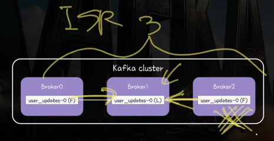
- Producer가 send 요청을 보내면 몇 개의 replica 까지 복제된 후에 요청에 대한 ACK 응답을 받을지
- 0 : ACK를 기다리지 않고 바로 성공 처리, 브로커도 요청을 처리만 하고 응답은 안함 -> 재시도 없음
- 1 : Leader 한테 write 되는지만 확인 -> 비동기 동기화가 안된 상황 발생 가능
- all(-1) 모든 ISR의 replica에 복제된 후에 ACK 응답(모든 Replica가 아닌 ISR이 중요)

### 브로커가 ACK를 보낼 최소 정족수 : min.insync.replicas(브로커 측 설정, 1)
- acks=all일 때 Producer의 요청을 ACK하기 위해 필요한 최소한의 ISR replica 수(Leader 포함한 숫자)
- acks=all일 때 현재 ISR < min.insync.replica -> 예외(NotEnoughReplicas, NotEnoughReplicasAfterAppend) 발생!
- 권장 값
  - replica factor : 3 (리더 포함 3개의 복제본을 두기)
  - min.insync.replicas : 2 (최소한 한명의 동의를 받고 produce 응답 처리)
  - ack : all

### ACK 받기까지 기다리는 시간 : request.timeout.ms(REQUEST_TIMEOUT_MS_CONFIG, 30sec)
- ClientRequest를 Kafka Cluster로 보낸 시점부터 응답까지 걸리는 최대 시간
- ack=0이면 의미 없음 : 보내고 응답을 별도로 보내지도 않음
- 타임 아웃 -> 재시도 시도 -> 예외 발생
  

### 재시도 최대 값(RETRIES_CONFIG, INT_MAX)
- 디폴트는 무한 재시도 -> kafka cluster로 보낸 요청이 재시도 가능한 이유로 실패했을 때 재시도 할 횟수
- Producer가 알아서 재시도해주는 것이 핵심
**- 무한 재시도를 수정하지 말고 전체 허용시간을 수정할 것을 권장함**
- 재시도 조건(횟수 + 시간) -> `retry.backoff.ms` 만큼 대기했다가 재시도
  - 조건1. 재시도 횟수(`retries`)가 남아있고
  - 조건2. 전체 허용 시간(delivery.timeout.ms)를 초과하지 않았고
  - 조건3. Producer 설정이 ack !=0
  - 조건4. 재시도가 유의한 에러일 때
    - LEADER_NOT_AVALIABLE -> 일시적인 에러이므로 재시도함
    - MESSAGE_TOO_LARGE -> 재시도해도 안됨

### 재시도 대기시간(RETRY_BACKOFF_MS_CONFIG, 100ms)
- 요청이 실패해서 재시도할 경우 기다리는 시간

### ACK 안 받은 동시 요청 수 : max.in.flight.requests.per.connection(MAX_IN_FLIGHT_REQUESTS_PER_CONNECTIONS, 5)
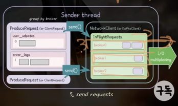
- Producer가 ACK 받기 전에 전송가능한 최대 요청 수
- 전체 통합 개수가 아니라 각 브로커와 연결별 최대 개수 -> 3개 브로커가 있으면 최대 5X3 = 15개 발송 가능
- 이 값이 1보다 크고, enable.idempotence=false 이고 재시도가 가능하다면 순서 역전이 발생가능함
  - A(실패) -> B(성공) -> A(재시도) 순 -> B,A로 저장됨
  - 재시도를 비활성화 하거나 enable.idempotence = true면 순서 보장

### Delivery.timeout.ms(DELIVERY_TIMEOUT_MS_CONFIG, 2mins)
- producer.send() 호출이 리턴된 시점(배치에 적재)부터 (재시도 시간 포함) 카프카로부터 ACK를 받기까지 기다리는 최대 시간을 설정
- 권장 값 : delivery.timeout.ms >= linger.ms + request.timeout.ms + retry.backoff.ms

### timeout 전체 정리
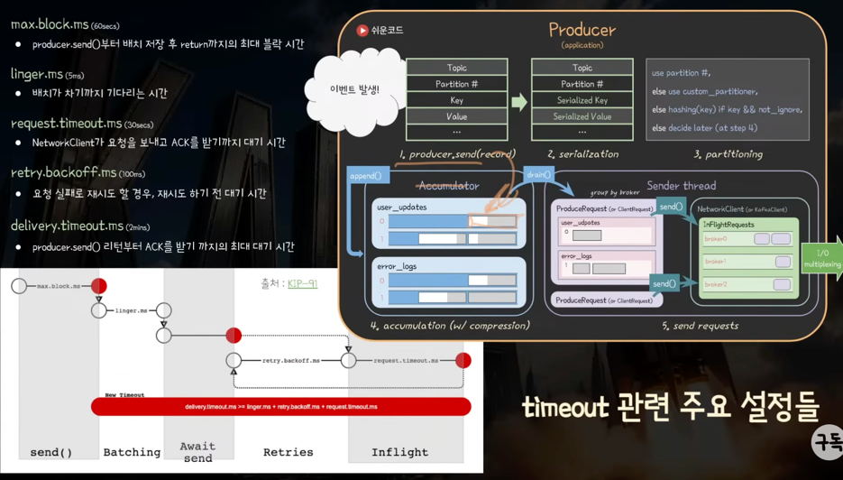

