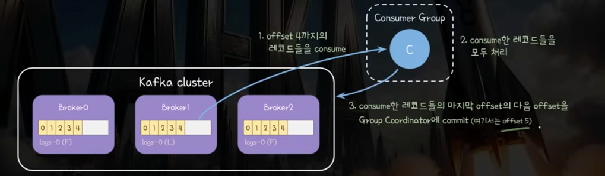
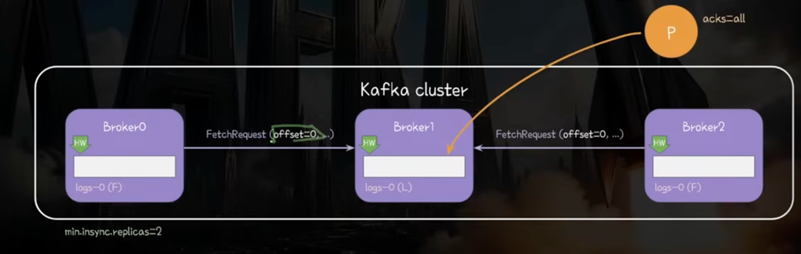
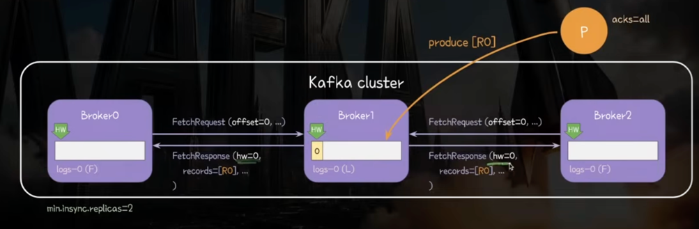
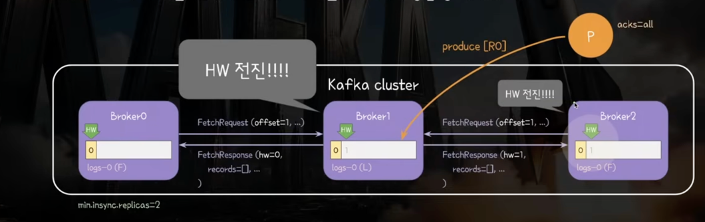
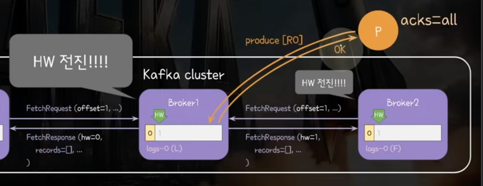
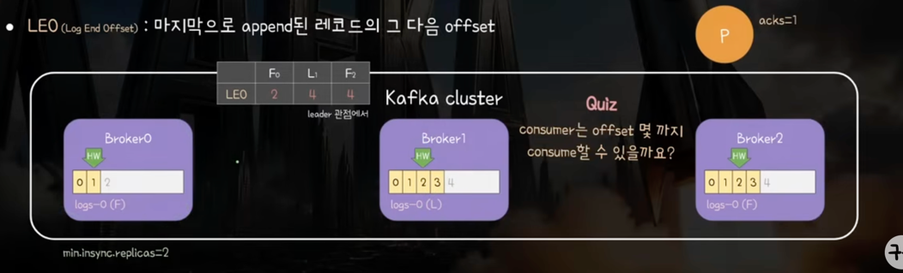
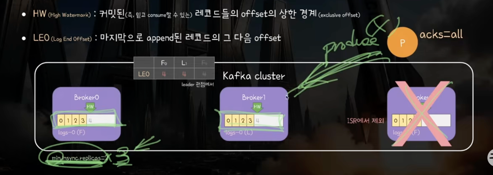

# 5부. Commit과 High WaterMark

## 핵심 문장
- Consumer는 HW 이전의 레코드들만 읽어감
- Leader와 Follwer의 HW 증가에는 약간의 시간차가 존재함

## Kafka에 존재하는 두가지 커밋

1) Consumer commit(안전하게 소비됨)
  - Consumer가 consume하여 처리한 records의 마지막 offset에 1을 더한 값, 즉 다음 차례의 offset 커밋
  - 커밋된 offset 직전까지 consumer에서 처리 완료했음을 의미
  - 
    - 1. Consumer가 offset 4까지 레코드를 소비
    - 2. consume한 레코드들을 모두 처리
    - 3. Group Coordinator에게 처리한 마지막 offset 다음 offset(4+1)을 commit

2) Broker- side commit(안전하게 복제됨)
  - ISR에 속한 모든 replica에 레코드가 복제되면 leader replica는 해당 레코드를 커밋함
  - 레코드 커밋 == High Watermark(SSOT)를 해당 레코드 오프셋 다음까지 전진시키는 것
  - HW : 커밋된 레코드들의 offset의 상한 경계(exclusive offset)
    - HW 미만인 것들이 안전하게 커밋된 것을 의미함
    - LEO 배열의 min 값
  - LEO(Log End offset) : 마지막으로 append된 레코드의 그 다음 offset
    - 리더는 각 ISR Replica의 LEO 배열을 관리함
    - ex) 레코드 하나가 들어와 offset 3에 append 되었다면 LEO는 3+1 =4

-> 핵심문장 : Consumer는 HW 이전의 레코드들만 읽어감

## 복제 스텝 알아보기

1) Follower -> Leader : FetchRequest 요청(offset부터 새로 갱신된 값 있으면 줘)
- Offset 기반으로 LEO 관리 배열에 Replica Leo를 업데이트 함
- LEO min값을 추려 Leader HW 옮김

2) Follower <- Leader : FetchResponse 응답(offset 부타의 Records + Leader HW 정보)
- 전달해준 레코드 만큼 append 함
- Follower는 리더 HW를 보고 자신의 HW도 조정

3) 다음 요청에서 offset min 값으로 HW 조정 -> Response에 담아 비동기적으로 전파
-> Leader <-> Follwer간 HW 전파에는 약간의 시간차가 존재함

4) 모두 복제된 것이 확인되어 HW를 옮기면 Producer에게 ACK 응답을 줌

### 왜 Conumser가 HW 미만의 값만 가져가게 하는 걸까?

- HW는 모든 레플리카에 복제되었음을 나타내는 경계선
- 따라서 HW 이후의 레코드는 다른 ISR에 복제가 안되었을 가능성이 존재 -> 리더 다운 시 레플리카 간의 데이터 불일치 발생 가능

### 브로커 다운 시에 min.insync.replica 설정에 따른 Exception
- replica factor : 3
- min.insync.replica : 3
-> 브로커 하나가 다운되면 ack를 위한 복제 최소 정족수를 클러스터가 만족시키지 못해 Produce단에서 Exception 발생

## 언제 ISR에서 제외되나

### replica.lag.time.max.ms(브로커 설정, 30sec)
- 아래 두 조건 중에 하나에 해당하면 ISR에서 제외
  - 위 시간 동안 follower가 leader에게 FetchRequest를 보내지 않음
  - 위 시간 동안 folower가 leader의 LEO를 따라잡지 못함

### 브로커 장애 관점에서 ISR이 중요한 이유
- ISR은 정해진 시간 내의 리더 LEO를 잘 동기화하고 있는 브로커 (= 리더를 대체해도 되는 브로커)
- 리더가 다운되면 ISR 중에 하나의 replica가 leader가 됨
